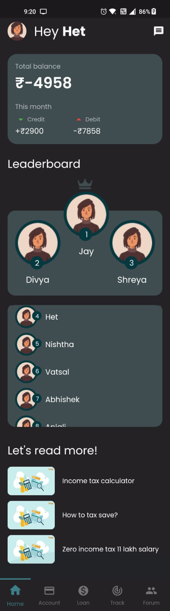

# 💲pend💲ense

A new Flutter project.

## About

$pend$ense is a mobile app designed to provide a seamless user experience for students who are looking to manage their finances effectively. With this app, users can easily track their expenses, create budgets, manage their loans, and make informed decisions about their financial goals - all from the convenience of their mobile device.

One of the unique feature of $pend$ense is its social networking functionality. The app includes forums and personal chats where students can connect with their peers or mentors and share or receive advice on how to manage their finances, including their loans. This feature creates a community of students who can learn from one another, share their experiences, and support each other in achieving their financial goals.

$pend$ense offers a leaderboard on the home page, which allows users to compete with their peers in a friendly way. This feature motivates users to stay on track with their financial goals, including their loan repayment, and creates a fun and engaging user experience. The leaderboard score is calculated using a machine learning algorithm that takes into account the user's financial habits, including their spending, saving, and loan repayment behavior.

Another feature of $pend$ense is its loan management functionality. The app includes tools to help students manage their student loans, including tracking balances, payments, and due dates. This feature allows users to stay on top of their loan obligations and avoid missing payments, which can negatively impact their credit score.

The app is also designed to educate users about financial management, including loan management. The app provides web-in-app financial articles that offer useful tips and advice on how to manage finances effectively, including how to manage loans. Additionally, the app includes web-in-app links that help users make informed decisions about their loan options, including refinancing and consolidation.

Finally, $pend$ense keeps track of all the transactions and goals of its users, including their loan management. This feature helps users stay on top of their finances and make informed decisions about their spending, saving, and loan repayment habits. Overall, $pend$ense is a powerful tool for students looking to manage their finances effectively, build their financial literacy, and connect with their peers for support and advice, including their loan management, while engaging with a fun and innovative leaderboard algorithm.

## Screens

  
  
  
  
  
  
  
  
  
  
  
  
  
  
  
  

